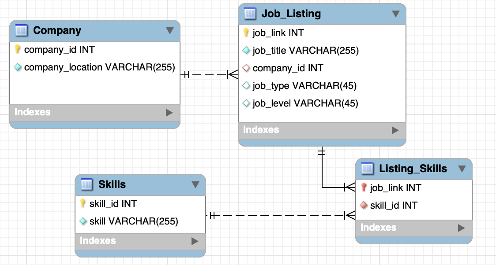

## Project 3 - Data Science Skills

### Which are the most valued data science skills?

#### **Introduction**
This project aims to identify the most valued data science skills by finding the most asked for data science skills in job listings. Our team found a set of data on kaggle called [Data Science Job Postings & Skills](https://www.kaggle.com/datasets/asaniczka/data-science-job-postings-and-skills) that provides Data Science job listings from LinkedIn for 2024. This data set includes three csv files:  
- job_postings.csv: job_link, job_title, company, job_location, job_level, job_type  
- job_skills.csv: job_link, job_skills  
- job_summary.csv: job_link, job_summary  

We will focus our analysis with data from job_postings.csv and job_skills.csv.

First we will clean up our data from both files. Then we will normalized the data to prepare it to upload as SQL tables. Finally we will analyze the data to find out which is the most asked for data science skill in LinkedIn job listings.


#### Cleaning up data
In this part of the project we will load the data into R data frame and clean up each observations so that we can put it in a normalized table. 

```{r load-packages, message=FALSE}
library(tidyverse)
```

**Read csv files**
```{r}
# Loading job_skills.csv and load into dataframe job_skills
file<-"https://raw.githubusercontent.com/stephbc/DATA607-Project3/refs/heads/main/job_skills.csv"
job_skills<-read.csv(file, sep=',')

# Loading job_poastings.csv and load into dataframe job_postings
file <- "https://raw.githubusercontent.com/stephbc/DATA607-Project3/refs/heads/main/job_postings.csv"
job_postings <- read.csv(file, sep=',')

```

**Cleaning up job_skills table**
Make sure that the Job_Skills has a job_id column and it's associated skills.
Make sure that the skills column does no include any white spaces and does not include any null values.
```{r}
#create a function to extract the ID numbers from the job_link:
id<- function(df) {
  stringr::str_extract(df, "(\\d)+$")
}
#transform and rename job_link to job_ID:
job_skills$job_link<-id(job_skills$job_link)
names(job_skills)[names(job_skills)=='job_link'] <-"job_ID"

# Remove duplicate job_ID
job_skills <- job_skills %>% 
  group_by(job_ID) %>% 
  slice(1) %>% 
  ungroup()

#separate the skills:
job_skills_clean<- job_skills %>%
  separate_wider_delim(job_skills, delim=',',
                       names_sep = '_',
                       too_few = 'align_start')

#pivot_longer to put all skills into one column:
job_skills_clean<- job_skills_clean %>%
  pivot_longer(cols = starts_with("job_skills"),
               names_to = 'Sets',
               values_to = 'Skills',
               values_drop_na = TRUE)

# Cleaning up the data in skills
# trim white space
job_skills_clean$Skills <- trimws(job_skills_clean$Skills)
# set empty spaces to null
job_skills_clean$Skills <- na_if(job_skills_clean$Skills, "")
# change all cases to upper case so when we group by case is not a factor
job_skills_clean$Skills <- toupper(job_skills_clean$Skills)

# Drop the sets column
job_skills_clean <- job_skills_clean %>% select(-c(Sets))

head(job_skills_clean)

```

**Cleaning up the job_postings table**

```{r}
# Using the function created before to change job_link to job_id
job_postings$job_link <- id(job_postings$job_link)
names(job_postings)[names(job_postings)=='job_link'] <-"job_ID"

# Extract the columns we need
job_postings<-job_postings[-c(3:6, 10:11)]

# Remove duplicate job_ID
job_postings <- job_postings %>% 
  group_by(job_ID) %>% 
  slice(1) %>% 
  ungroup()

```

**Separate job_location**
```{r}
#  Set of pattern for Countries and States
Countries <- c("Australia", "Canada", "Italy", "Mexico", "United Kingdom", "United States")
Countries <- paste(Countries, collapse = "|")
States <- c("DC" , "AL" , "AK" , "AS" , "AZ" , "AR" , "CA" , "CO" , "CT" , "DE" , "FL" , "GA" , "GU" ,
            "HI" , "ID" , "IL" , "IN" , "IA" , "KS" , "KY" , "LA" , "ME" , "MD" , "MA" , "MI" , "MN" , 
            "MS" , "MO" , "MT" , "NE" , "NV" , "NH" , "NJ" , "NM" , "NY" , "NC" , "ND" , "OH" , "OK" , 
            "OR" , "PA" , "PR" , "RI" , "SC" , "SD" , "TN" , "TX" , "UT" , "VT" , "VA" , "WA" , "WV" , 
            "WI" , "WY")
States <- paste(States, collapse = "|")

#-------------------------------------------------------------------
# job_location can be read as City, State/Province, and Country separated by ","
# but this column has entries where it's missing either entry so we first have
# to split the job_location by deliminator then check:
# -Country can be listed out in either State/Province or City
# -State_or_Province may contain only US States without listing Country
# -City may only contain the name of the Country
#-------------------------------------------------------------------

# Split job_location to City, State/Province, and Country
job_postings_clean<- job_postings %>%
  separate_wider_delim(cols = job_location,
                       delim=",",
                       names=c("Ci", "SoP", "Co"),
                       too_few = 'align_start',
                       too_many = 'merge')

# Cleaning up the data in job_posting
job_postings_clean <- job_postings_clean %>% 
# trim white space for City, State/Province, and Country
  mutate(Ci = str_trim(Ci), 
      SoP = str_trim(SoP),
      Co = str_trim(Co)) %>% 
  # set empty spaces to null
  mutate(Ci = na_if(Ci,""), 
      SoP = na_if(SoP,""),
      Co = na_if(Co,""))
  
# Helper Columns to see if city or state contains country
job_postings_clean <- job_postings_clean %>% 
  mutate(
    # Check if city contains country
    matchCity = sapply(Ci, function(x) {
      matches <- regmatches(x, regexpr(Countries, x))
      if (length(matches) > 0) matches else NA
        }
      ),
    # Check if State contains country
    matchSoP1 = sapply(SoP, function(x) {
      matches <- regmatches(x, regexpr(Countries, x))
      if (length(matches) > 0) matches else NA
        }
    ),
    # check if States contains the 50 US states
    matchSoP2 = sapply(SoP, function(x) {
      matches <- regmatches(x, regexpr(States, x))
      if (length(matches) > 0) "United States" else NA
        }
    ),
    matSoP = coalesce(matchSoP1, matchSoP2)
  )

job_postings_clean <- job_postings_clean %>%
  mutate(
# Check the cases for when Country is empty  
    Country = case_when(
      !is.na(Co) ~ Co,
      !is.na(matSoP) ~ matSoP,
      !is.na(matchCity) ~ matchCity,
      is.na(Ci) ~ NA,
      TRUE ~ NA
    ),
# Check the cases for when State or Province does not have Country name
    State_or_Province = ifelse(is.na(matchSoP1),SoP, NA),

# Check the cases for when City does not contain State or Country
    City = case_when(
      !is.na(State_or_Province) ~ Ci,
      is.na(matchCity) ~ Ci,
      Country != matchCity ~ Ci,
      TRUE ~ NA
      )
  ) %>% 
  # Remove helper columns
  select(-c(Ci, SoP, Co, matchCity,matchSoP1,matchSoP2,matSoP))

#Extract date from last_processing column:
job_postings_clean$last_process_date<- format(as.Date(job_postings_clean$last_processed_time), format = "%m-%d-%Y") 

job_postings_clean <-  job_postings_clean%>% 
  select(-c(last_processed_time))

head(job_postings_clean)
```


#### Normalization
Based on our Normalized Relational Diagram we will normalize our data into 4 tables.
We want to organize our tables that represent a company can have multiple locations and multiple job listings (1 to many) and each listing may require multiple skills



```{r}
# Normalized skills table with skill_ID assigned
Skills_Normalized <- job_skills_clean %>% 
  drop_na(Skills) %>% 
  arrange(Skills) %>% 
  distinct(Skills) %>% 
  mutate(Skill_ID = 1:n())

# Normalized company table with Company_ID assigned
Company_Normalized <- job_postings_clean %>%
  filter(!is.na(City),!is.na(State_or_Province),!is.na(Country)) %>% 
  #Removing duplicate rows across company, city, and state_or_province or company per location ID creation
  distinct(company, City, State_or_Province, Country, .keep_all = TRUE) %>%
  mutate(Company_id = row_number()) %>%
  relocate(Company_id, .before = 1) %>% 
  select(Company_id, Company = company, City, State_or_Province, Country)

# Normalized Job_Listings table
Job_Listing_Normalized <- job_postings_clean %>%
  #select(job_ID, job_title, company , job_type, job_level) %>% 
  # Join the Company table for Company_id
  left_join(Company_Normalized, join_by(company == Company, City== City, State_or_Province==State_or_Province, Country==Country), relationship = "many-to-many")
  
# Normalized Listing_Skills table
Listing_Skills_Normalized <- job_skills_clean %>% 
  left_join(Skills_Normalized)
Listing_Skills_Normalized <- Listing_Skills_Normalized %>% 
  select(job_ID, Skill_ID)

```


#### Analyze 
```{r}

```


