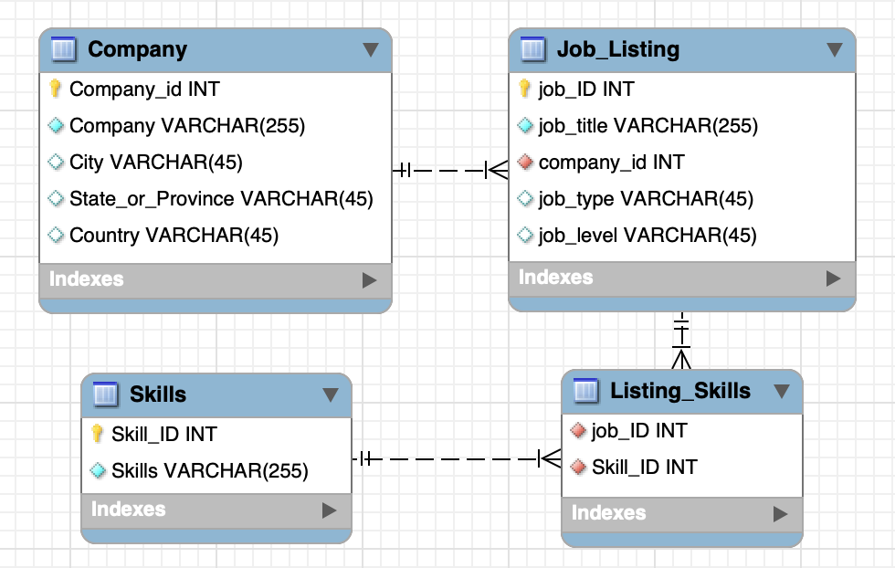

# DATA607-Project3

**PROPOSAL**

Authors

- Chi Hang (Philip) Cheung
- Stephanie Chiang
- Ying Fang Lee
- Brandon Chung

Collaboration Tools

- Github – project organization, documentation, and code sharing
- Slack – communications

Data Sources

- Kaggle - [Data Science Job Postings & Skills (2024)](https://www.kaggle.com/datasets/asaniczka/data-science-job-postings-and-skills?select=job_skills.csv) for `job_postings.csv` and `job_skills.csv`

Data Loading

- Data will be loaded via raw data URL into R studio

Data Transformations / Normalized Database Model

- In our normalized database we would ideally have four tables as seen below –

